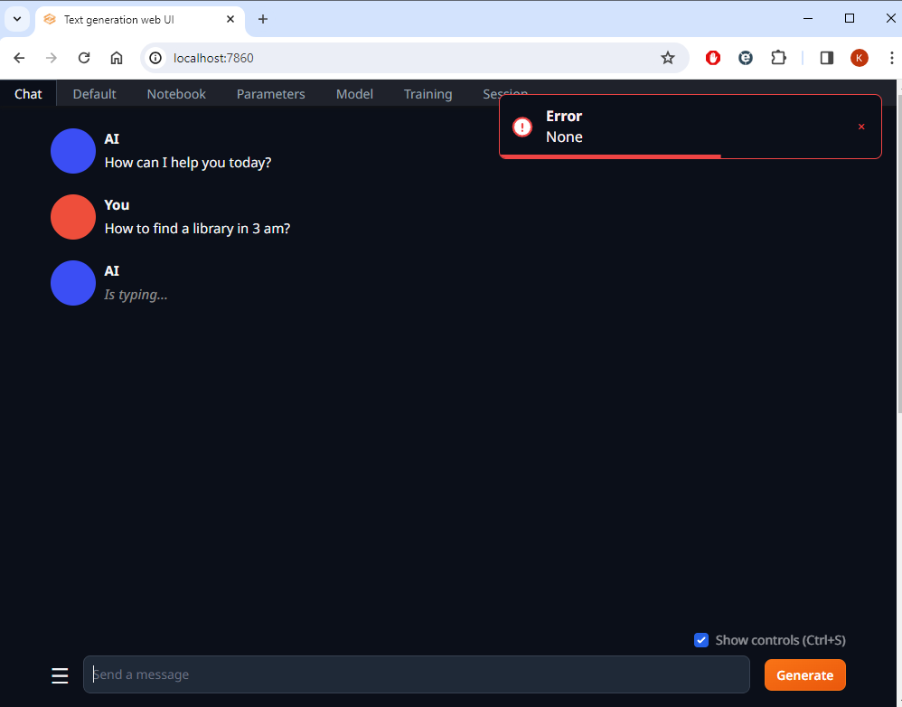
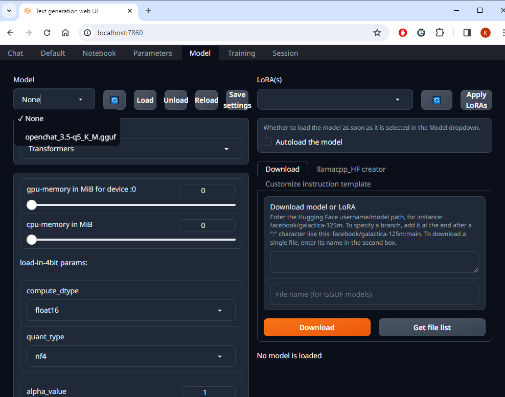
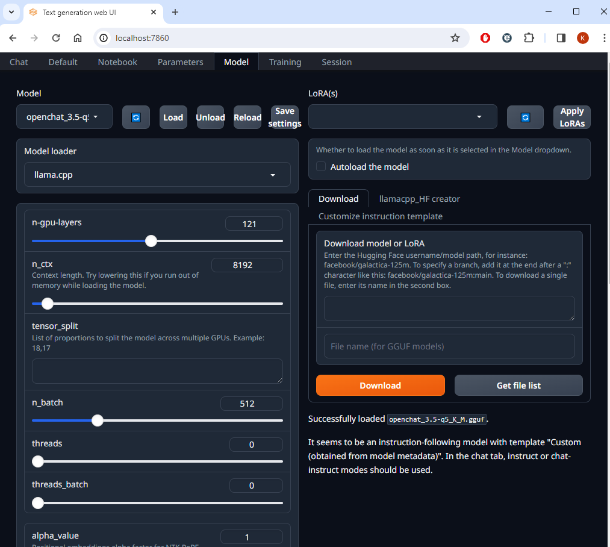
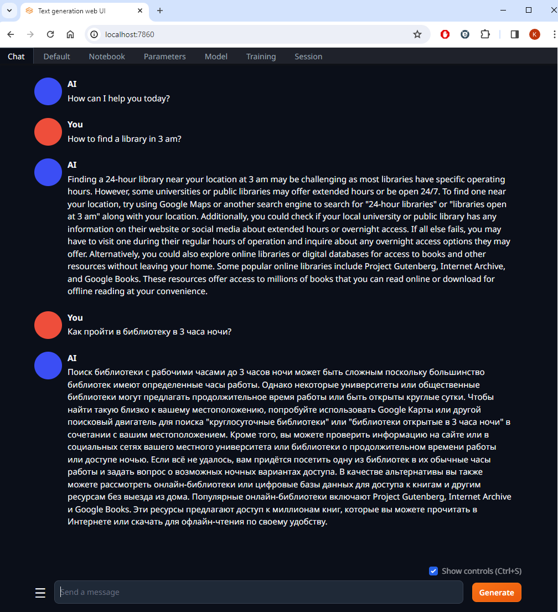
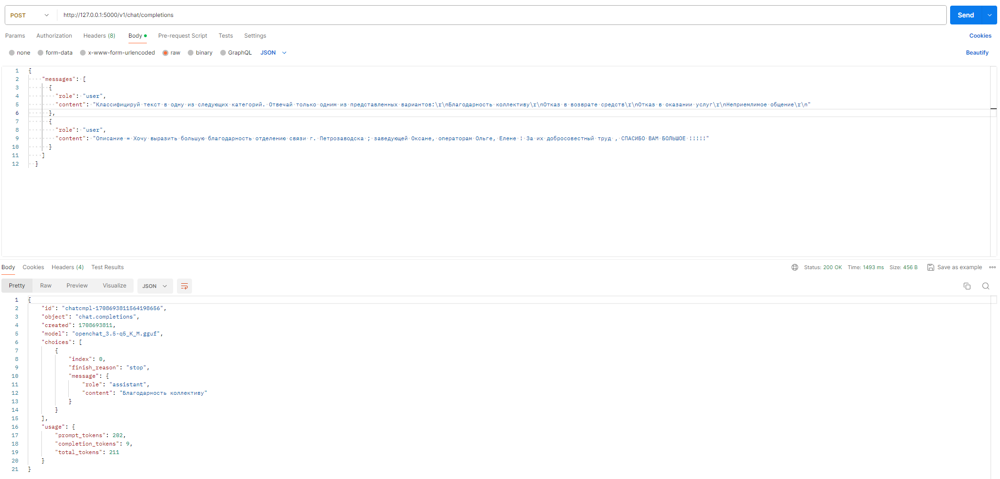

# Setup for On-Premise Open LLM using Text Generation Web UI
A brief setup guide for text-generation-webui on Windows

# Table of Contents
1. [Prepare Text Generation Web UI](#prepare-text-generation-web-ui)
2. [Model preparation (Optional)](#model-preparation-optional)
3. [Launch with Model](#launch-with-model)
4. [References](#references)

## Prepare Text Generation Web UI
### Download
```bash
$ git clone https://github.com/oobabooga/text-generation-webui
```
Initially, the download size is  approximately 60 Mb.

### Manual launch
```bash
$ cd text-generation-webui/
$ ./start_windows.bat
```

The process promtps a few questions:
```bash
What is your GPU?

A) NVIDIA
B) AMD (Linux/MacOS only. Requires ROCm SDK 5.6 on Linux)
C) Apple M Series
D) Intel Arc (IPEX)
N) None (I want to run models in CPU mode)

Input> A

Do you want to use CUDA 11.8 instead of 12.1? Only choose this option if your GPU is very old (Kepler or older).
For RTX and GTX series GPUs, say "N". If unsure, say "N".

Input (Y/N)> N
Collecting package metadata (current_repodata.json): ...working... done

```

Eventually, you will see the following output
```bash
14:39:47-206549 INFO     Starting Text generation web UI
14:39:47-211278 INFO     Loading the extension "gallery"
```
You should now be able to navigate to [localhost:7860](http://localhost:7860/) and access the UI. Note that nothing functions until a model is loaded.



Press Ctrl-C in the terminal and stop the running instance of Text Generation Web UI.

Folder size will now be approximately 10 Gb with all dependencies downloaded.

## Model preparation (optional)

### Why
Text generation Web UI supports a variety of model formats. Numerous models available on Hugging Face can be used as is, though this depends on the specific model and your hardware.

In my case, I used openchat-3.5, but it exceeded the capacity of my 12 GB GPU, so I [quantize](https://huggingface.co/docs/optimum/concept_guides/quantization) it. This step is not mandatory. In fact, quantized versions of openchat-3.5 are now available on Hugging Face.

### Get model
```bash
$ git clone https://huggingface.co/openchat/openchat_3.5
Cloning into 'openchat_3.5'...
remote: Enumerating objects: 92, done.
remote: Counting objects: 100% (88/88), done.
remote: Compressing objects: 100% (88/88), done.
remote: Total 92 (delta 48), reused 0 (delta 0), pack-reused 4
Unpacking objects: 100% (92/92), 475.23 KiB | 944.00 KiB/s, done.
Filtering content: 100% (3/3), 1.48 GiB | 1.15 MiB/s, done.
```
The size is approximately 30Gb.

### Install CMake
Download and install from https://cmake.org/download/

### Get llama.cpp
```bash
$ git clone https://github.com/ggerganov/llama.cpp.git
Cloning into 'llama.cpp'...
remote: Enumerating objects: 19173, done.
remote: Counting objects: 100% (6735/6735), done.
remote: Compressing objects: 100% (603/603), done.
remote: Total 19173 (delta 6490), reused 6167 (delta 6132), pack-reused 12438
Receiving objects: 100% (19173/19173), 21.68 MiB | 10.19 MiB/s, done.
Resolving deltas: 100% (13491/13491), done.
```
### Build llama.cpp and install dependencies
Navigate to the llama.cpp directory, create a build directory, and initialize the build process:
```bash
$ cd llama.cpp/
$ mkdir build
$ cd build
```
Proceed with the build:
```bash
$ cmake ..
-- Building for: Visual Studio 17 2022
-- Selecting Windows SDK version 10.0.22621.0 to target Windows 10.0.19045.
-- The C compiler identification is MSVC 19.38.33135.0
-- The CXX compiler identification is MSVC 19.38.33135.0
<...>
-- Configuring done (13.1s)
-- Generating done (0.5s)
-- Build files have been written to: C:/OpenChat2/llama.cpp/build
```
```bash
$ cmake --build . --config Release
MSBuild version 17.8.5+b5265ef37 for .NET Framework

  1>Checking Build System
  Generating build details from Git
  -- Found Git: C:/Program Files/Git/mingw64/bin/git.exe (found version "2.42.0.windows.2")
  Building Custom Rule C:/OpenChat2/llama.cpp/common/CMakeLists.txt
<...>
  Generating Code...
  test-tokenizer-1-llama.vcxproj -> C:\OpenChat2\llama.cpp\build\bin\Release\test-tokenizer-1-llama.exe
  Building Custom Rule C:/OpenChat2/llama.cpp/examples/tokenize/CMakeLists.txt
  tokenize.cpp
  tokenize.vcxproj -> C:\OpenChat2\llama.cpp\build\bin\Release\tokenize.exe
  Building Custom Rule C:/OpenChat2/llama.cpp/examples/train-text-from-scratch/CMakeLists.txt
  train-text-from-scratch.cpp
  train-text-from-scratch.vcxproj -> C:\OpenChat2\llama.cpp\build\bin\Release\train-text-from-scratch.exe
  Building Custom Rule C:/OpenChat2/llama.cpp/pocs/vdot/CMakeLists.txt
  vdot.cpp
  vdot.vcxproj -> C:\OpenChat2\llama.cpp\build\bin\Release\vdot.exe
  Building Custom Rule C:/OpenChat2/llama.cpp/CMakeLists.txt
```
After building, install the required Python dependencies:
```bash
$ cd ..
$ pip install -r requirements.txt
```
### Convert model to gguf
Use the provided script to convert the model format:
```bash
$ python convert.py ../openchat_3.5/  --outfile openchat_3.5-f16.gguf
Loading model file ..\openchat_3.5\pytorch_model-00001-of-00002.bin
Loading model file ..\openchat_3.5\pytorch_model-00001-of-00002.bin
Loading model file ..\openchat_3.5\pytorch_model-00002-of-00002.bin
params = Params(n_vocab=32002, n_embd=4096, n_layer=32, n_ctx=8192, n_ff=14336, n_head=32, n_head_kv=8, n_experts=None, n_experts_used=None, f_norm_eps=1e-05, rope_scaling_type=None, f_rope_freq_base=10000.0, f_rope_scale=None, n_orig_ctx=None, rope_finetuned=None, ftype=None, path_model=WindowsPath('../openchat_3.5'))
<...>
[290/291] Writing tensor output_norm.weight                     | size   4096           | type F32  | T+  31
[291/291] Writing tensor output.weight                          | size  32002 x   4096  | type F16  | T+  32
Wrote openchat_3.5-f16.gguf
```
### Quantize model
Quantization to reduce the model size:
[Estimates for different quantization types](https://www.reddit.com/r/LocalLLaMA/comments/142q5k5/updated_relative_comparison_of_ggml_quantization/)
```bash
$ ./build/bin/Release/quantize openchat_3.5-f16.gguf openchat_3.5-q5_K_M.gguf q5_K_M
main: build = 2249 (15499eb9)
main: built with MSVC 19.38.33135.0 for x64
main: quantizing 'openchat_3.5-f16.gguf' to 'openchat_3.5-q5_K_M.gguf' as Q5_K_M
llama_model_loader: loaded meta data with 22 key-value pairs and 291 tensors from openchat_3.5-f16.gguf (version GGUF V3 (latest))
llama_model_loader: Dumping metadata keys/values. Note: KV overrides do not apply in this output.
llama_model_loader: - kv   0:                       general.architecture str              = llama
<...>
[ 290/ 291]                   output_norm.weight - [ 4096,     1,     1,     1], type =    f32, size =    0.016 MB
[ 291/ 291]                        output.weight - [ 4096, 32002,     1,     1], type =    f16, quantizing to q6_K .. size =   250.02 MiB ->   102.55 MiB
llama_model_quantize_internal: model size  = 13813.05 MB
llama_model_quantize_internal: quant size  =  4893.00 MB

main: quantize time = 42952.59 ms
main:    total time = 42952.59 ms
```

## Launch with model

Copy or move the model into the models directory text-generation-webui\models:
```bash
$ cp openchat_3.5-q5_K_M.gguf ../text-generation-webui/models
```

Relaunch Text generation web UI, this time also enableing API access:
```bash
$ ./start_windows.bat --api
```

Navigate to **Model** tab in UI, select your model:


Adjust the **n_gpu_layers** value and click **Load**:

The system should display a "**Successfully loaded <model_name>**" message.

The **n_gpu_layers** setting affects speed and GPU memory usage; adjust to maximize usage within your GPU's capacity.

Click **Save settings** to save configuration values.
To load particular model at startup use --model flag:
```bash
$ ./start_windows.bat --api --model openchat_3.5-q5_K_M.gguf
```

You can now use the Chat tab:


and the API, which is compatible with OpenAI API https://platform.openai.com/docs/api-reference/making-requests:


## References
https://github.com/oobabooga/text-generation-webui?tab=readme-ov-file#text-generation-web-ui

https://huggingface.co/openchat/openchat_3.5

https://habr.com/ru/articles/776314/

https://platform.openai.com/docs/api-reference/making-requests